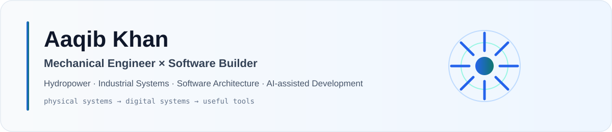

<picture>
  <source media="(prefers-color-scheme: dark)" srcset="./assets/profile-banner-dark.svg">
  <source media="(prefers-color-scheme: light)" srcset="./assets/profile-banner-light.svg">
  
</picture>

I work on utility-scale hydropower systems and build software for operations, productivity and real-world workflows.

[**Portfolio**](https://aaqibkhan.me) &nbsp;·&nbsp;
[**Prism Inventory**](https://inventory.aaqibkhan.me)

---

## Profile

<table>
<tr>
<td width="50%" valign="top">

### Engineering

**Domain**  
Utility-scale hydropower

**Focus**  
Mechanical maintenance · Hydraulic systems · Rotating equipment · Reliability

**Method**  
Failure modes · Root-cause thinking · Maintainability · Operational risk

</td>
<td width="50%" valign="top">

### Software

**Domain**  
Operational and personal software systems

**Focus**  
Architecture · APIs · Data models · Automation · AI-assisted development

**Method**  
Clear boundaries · Maintainable systems · Practical workflows

</td>
</tr>
</table>

---

## Now

| Track | Current focus |
|---|---|
| **Engineering** | Hydropower mechanical maintenance, reliability and technical leadership |
| **Building** | Prism Inventory, PrismOS and aaqibkhan.me |
| **Learning** | System architecture, AI-assisted development and MEP/HVAC |

---

## Selected projects

<table>
<tr>
<td width="50%" valign="top">

### Prism Inventory
ACTIVE · PRIVATE SOURCE

Inventory and spare-parts management designed around maintenance operations.

**Focus:** Stock · Receiving · Requests · Transfers · Audit history

[**Open application →**](https://inventory.aaqibkhan.me)

</td>
<td width="50%" valign="top">

### PrismOS
IN DEVELOPMENT · PRIVATE

An owner-only operating system for finance, tasks, calendar, projects, people, assets and controlled integrations.

**Stack:** Flutter · Riverpod · FastAPI · PostgreSQL

</td>
</tr>

<tr>
<td width="50%" valign="top">

### aaqibkhan.me
IN DEVELOPMENT · PRIVATE SOURCE

An editorial portfolio connecting hydropower engineering, technical case studies and software systems work.

**Stack:** Next.js · Payload CMS · PostgreSQL · Docker

[**Open portfolio →**](https://aaqibkhan.me)

</td>
<td width="50%" valign="top">

### AK Store
IN DEVELOPMENT · PRIVATE

A Flutter e-commerce application for authentication, catalog, accounts, media and commerce workflows.

**Stack:** Flutter · Dart · Firebase · Firestore · GetX

</td>
</tr>
</table>

---

## Engineering focus

| Systems | Practice |
|---|---|
| Francis turbines | Preventive and corrective maintenance |
| Generators and rotating equipment | Troubleshooting and failure analysis |
| Hydraulic systems | Reliability and maintenance planning |
| Mechanical auxiliaries | Safe execution and operational coordination |

---

## Technology

  

**Applications:** Flutter · Dart · Next.js  
**Backend & data:** Python · FastAPI · PostgreSQL · SQLAlchemy · Firebase  
**Delivery:** Docker · Linux · GitHub · Cloudflare

---

## Engineering × Software

Mechanical engineering trained me to think in **systems, constraints, failure modes, interfaces, maintenance and reliability**. Software gives me another medium for applying the same thinking.

Most of what I build follows that intersection: practical systems for organizing, automating and improving real work.

 

**Build useful systems. Understand how they work.**

[aaqibkhan.me](https://aaqibkhan.me)

